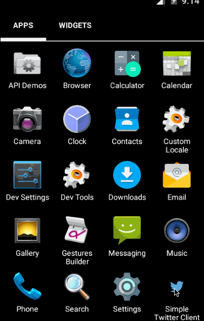
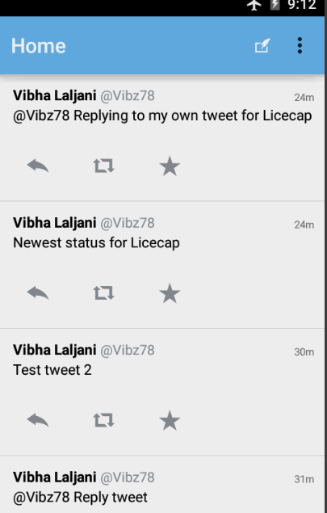

# Twitter Client

This is an Android application for a simple Twitter Client, which allows a user to view a Twitter timeline and compose a tweet.

Time Spent: ~20 - 22 hours + ~22 - 25 hours
Completed user stories:

 * [x] Required: User can sign in to Twitter using OAuth login.
 * [x] Required: User can view the tweets from their home timeline:
       * User is displayed the username, name, and body for each tweet
       * User is displayed the [relative timestamp](https://gist.github.com/nesquena/f786232f5ef72f6e10a7) for each tweet "8m", "7h"
       * User can view more tweets as they scroll with [infinite pagination](http://guides.codepath.com/android/Endless-Scrolling-with-AdapterViews)
       * Links in tweets are clickable and will launch the web browser
 * [x] Required: User can compose a tweet
       * User can click a “Compose” icon in the Action Bar on the top right
       * User can then enter a new tweet and post this to twitter
       * User is taken back to home timeline with new tweet visible in timeline
       * User can see a counter with total number of characters left for tweet
 * [x] Advanced: User can refresh tweets timeline by [pulling down to refresh](http://guides.codepath.com/android/Implementing-Pull-to-Refresh-Guide)
 * [x] Advanced: User can open the twitter app offline and see last loaded tweets (Tweets are persisted into sqlite and can be displayed from the local DB) 
 * [x] Advanced: User can tap a tweet to display a "detailed" view of that tweet
 * [x] Advanced: User can select "reply" from detail view to respond to a tweet
 * [x] Advanced:Improve the user interface and theme the app to feel "twitter branded"
       * Login screen resembles the Twitter login screen
         - World map background
         - Login to Twitter button with the Twitter color and bird icon
         - Twitter caption (Follow your interests...) 
       * Compose tweet dialog screen has the Twitter colors (and looks pretty close to the actual app)
         - The tweet button is Twitter-blue and has rounded corners
         - It's disabled and changes color accordingly when <= 0 characters or >= 140 
       * Reply dialog shows the @ tag upon opening 
       * The detailed view has been laid out (including buttons etc) to look like the Twitter client too. 
 * [x] Bonus: User can see embedded image media within the tweet detail view
 * [x] Bonus: Compose activity is replaced with a modal overlay 
 
 * [x] Required: User can switch between Timeline and Mention views using tabs.
       - User can view their home timeline tweets.
       - User can view the recent mentions of their username.
 * [x] Required: User can navigate to view their own profile to see picture, tagline, # followers, # following, # tweets and the tweets
 * [x] Required: User can click on the profile image in any tweet to see another user's profile.
      - User can see picture, tagline, # of followers, # of following, and tweets of clicked user.
      - Their timeline
 * [x] User can infinitely paginate any of these timelines (home, mentions, user) by scrolling to the bottom -- I know this is required and it was working till this morning (it was even working in last week's submission). 
~9:30: However, I played around with some stuff to try to have more in the abstract class and it suddenly doesn't work anymore. The odd thing is that it doesn't even return all the 25 of the original - only 19. I am working on this and will update the project. 
~9:42 Edit: It seems to be working now. I think it was just hitting a weird rate limit thing. I have a licecap recording which shows about 45 tweets in the home timeline. Please let me know if there's sth else I can do to show this. 
 * [x] Advanced: User can "reply" to any tweet on their home timeline - and the user that wrote the original tweet is automatically "@" replied in compose
 * [x] Advanced: User can click on a tweet to be taken to a "detail view" of that tweet
 * [x] Advanced: User can take favorite/unfavorite/retweet actions on any timeline + the detail view of a tweet
 * [x] Advanced: Advanced: Improve the user interface and theme the app to feel twitter branded
       - All the screens (detailed tweet view, action bars, timelines, user profiles, favorite, retweet colors) have been mimicked to look like the original Twitter client in terms of arrangement and colors.
 * [x] Advanced: User can search for tweets matching a particular query and see results + you can see the top tweets and all tweets using sliding tabgs just like the Twitter client
 
Libraries that helped make the project easier :-)

[Android async-http](http://loopj.com/android-async-http/) to make calls to the Google API

[Picasso](http://square.github.io/picasso/) to help load the images

[ActiveAndroid](https://github.com/pardom/ActiveAndroid/wiki/Getting-started) to help persist to SQLLite DB

Codepath jars for OAuth

[Pager Sliding Tab Strip](https://github.com/astuetz/PagerSlidingTabStrip)

Video Walk Through: 

Video Walk Through in offline mode: (I just realized that my favorites and retweet count for offline might not be storing correctly - I'm looking into it
Edit: It's storing correctly in the DB - but displaying incorrectly. Now looking into that. ) 

